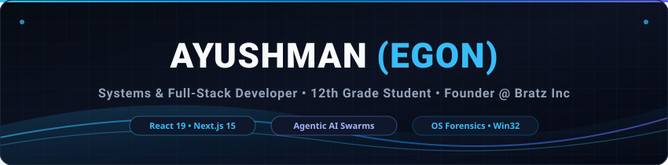
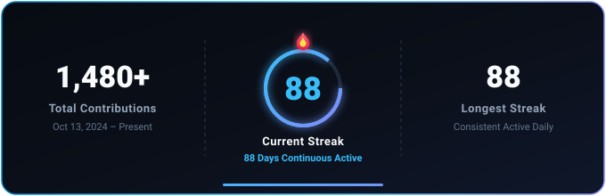

  <!-- Header Banner with Cyber Wave Aesthetic -->
  

  <!-- Animated Typing Subtitle -->
  

  <!-- Social Badges & Status Pills -->
  

    
    
    
    
  

---

###  Executive Overview

I am a **17-year-old Systems & Full-Stack Developer** (Class 12th) and the founder of **Bratz Inc.** I bridge the gap between high-level web applications and low-level operating system internals, building autonomous agentic architectures and high-performance software.

-  **Academic Foundations**: High school senior (Class 12th) balancing academic studies with building production-grade software.
-  **Full-Stack Mastery**: Deeply specialized in **React, Next.js, Node.js, Python, and Java**, delivering buttery-smooth reactive frontends, sub-millisecond API pipelines, and robust state machines.
-  **AI Agent Orchestration & Rapid Prototyping**: Pioneering autonomous agent swarms and high-velocity development workflows — turning complex ideas into hardened production software in record time.
-  **Systems & Security**: Developing low-level Windows latency tuners and anti-cheat reverse-engineering forensic inspectors.

---

###  Flagship Projects

<table>
  <tr>
    <td colspan="2" valign="top">
      <h3 align="center"> Autonomous Agentic Enterprise ERP</h3>
      

        <b>The World's 1st Autonomous Agent-Powered ERP Platform (Private Enterprise)</b>
      

      

        An enterprise resource planning platform engineered from the ground up with autonomous AI agents. Replaces operational bottlenecks with intelligent agent swarms executing automated double-entry accounting, real-time inventory ledgering, multi-vendor supply chain tracking, predictive demand forecasting, and autonomous decision routing.
      

      

        <code>AI Agents</code> &bull; <code>Enterprise ERP</code> &bull; <code>React 19</code> &bull; <code>Next.js 15</code> &bull; <code>Python</code> &bull; <code>Node.js</code> &bull; <code>Private Core</code>
      

    </td>
  </tr>
  <tr>
    <td width="50%" valign="top">
      <h3 align="center"> ATLAS by Bratz</h3>
      

        <b>Windows Performance Suite & Threat Hunter</b>
      

      

        High-performance Windows latency tuner and anti-cheat forensic scanner built with <b>Rust</b>, <b>Tauri v2</b>, and Win32 internals. Features an enterprise 12-tier forensic engine detecting remote thread injections (<code>svchost.exe</code>), root droppers, and kernel exploit drivers.
      

      

        <code>Rust</code> &bull; <code>Tauri</code> &bull; <code>Win32 API</code> &bull; <code>Forensics</code>
      

    </td>
    <td width="50%" valign="top">
      <h3 align="center"> Free AI Bridge</h3>
      

        <b>High-Performance Multi-Model AI Proxy</b>
      

      

        Resilient proxy bridge integrating leading AI models into SaaS applications with full OpenAI API compatibility. Features cookie-based session management, intelligent failover routing, vision support, and real-time streaming tokens.
      

      

        <code>TypeScript</code> &bull; <code>Node.js</code> &bull; <code>OpenAI API</code> &bull; <code>SaaS</code>
      

    </td>
  </tr>
</table>

---

###  Technical Arsenal

#### Web & Full-Stack Development

#### Autonomous AI & Agentic Orchestration

#### Low-Level & Systems Development

#### Reverse Engineering & Threat Forensics

---

###  Activity & Telemetry

  

    
    &nbsp;
    
    &nbsp;
    
    &nbsp;
    
  

    

  

---

###  Connect & Community

  
Got an inquiry, collaborating on autonomous agent architectures, or joining the Bratz Inc ecosystem?

  
  &nbsp;&nbsp;
  

    
  Engineered with precision &bull; Powered by <b>Bratz Inc.</b>

